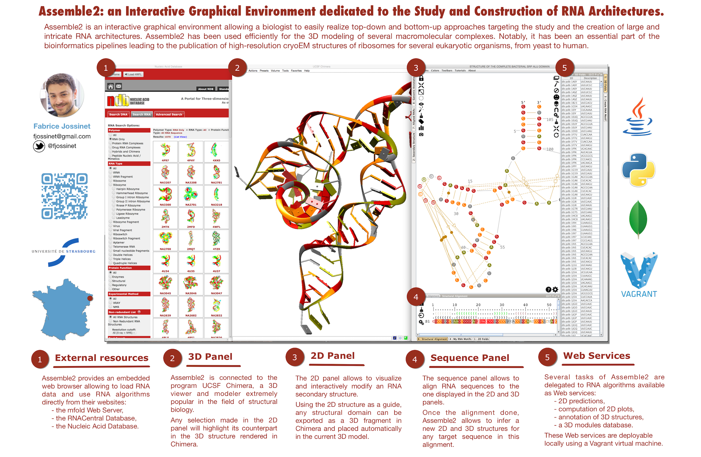

# Assemble2: visualize, construct and study RNA architectures

Main features:

* Assemble2 allows you to visualize and edit RNA structures described in a file (CT, BPSep, FASTA, PDB) or recovered from databases (RFAM, PDB, SSTRAND).
* Assemble2 provides a panel dedicated to the dispaly and the interactive manipulation of an RNA secondary structure (2D).
* if the 2D is derived from a solved 3D, Assemble2 can load this 3D into to the viewer [UCSF Chimera](http://www.cgl.ucsf.edu/chimera/).
* Assemble2 keeps a link between the two structures, making the 2D a guide in the exploration of the solved 3D.
* this link makes also the 2D a guide for the construction of a new 3D. Each selection in the 2D can be used to query a database of 3D fragments to be assembled into a 3D model.
* Assemble2 is connected to RNA algorithms and databases made available as Web Services from a cloud in order to automate recurrent tasks of a working session:
  * 2D prediction from an RNA primary sequence
  * 2D annotation from an RNA tertiary structure
  * 2D plot of a secondary structure
  * query of 3D fragments from a 2D selection

Assemble2 has been developed with the Java language on MacOSX. It has been tested on MacOSX and Linux Ubuntu. But it should run on any operating system having a Java environment.

* [Documentation](https://github.com/fjossinet/assemble2/wiki)
* [Download and installation](https://github.com/fjossinet/assemble2/wiki/Download-and-installation)

